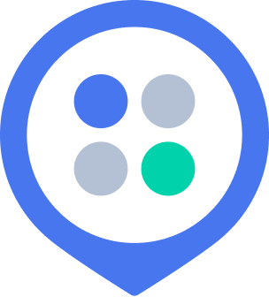

# mukgosalja

2022 Jumpit Hackerton : 9조 "먹고살자"팀 / 사람인 지역 내 채용공고 검색 솔루션 프로젝트

<!--
*** Thanks for checking out the Best-README-Template. If you have a suggestion
*** that would make this better, please fork the repo and create a pull request
*** or simply open an issue with the tag "enhancement".
*** Don't forget to give the project a star!
*** Thanks again! Now go create something AMAZING! :D
-->

<!-- PROJECT SHIELDS -->
<!--
*** I'm using markdown "reference style" links for readability.
*** Reference links are enclosed in brackets [ ] instead of parentheses ( ).
*** See the bottom of this document for the declaration of the reference variables
*** for contributors-url, forks-url, etc. This is an optional, concise syntax you may use.
*** https://www.markdownguide.org/basic-syntax/#reference-style-links
-->
<!-- [![Contributors][contributors-shield]][contributors-url]
[![Forks][forks-shield]][forks-url]
[![Stargazers][stars-shield]][stars-url]
[![Issues][issues-shield]][issues-url]
[![MIT License][license-shield]][license-url]
[![LinkedIn][linkedin-shield]][linkedin-url] -->

<!-- PROJECT LOGO -->
 

  

  <h3 align="center">먹고살자!</h3>

  

    지역내 공고 검색 솔루션 서비스
    <!--  
    <a href="https://github.com/othneildrew/Best-README-Template"><strong>Explore the docs »</strong></a>
      -->
     
    <a href="https://www.figma.com/file/7frFNq7ZhJSDoQ9BQOgMG5/Untitled?node-id=2%3A862">View Figma</a>
    ·
    <a href="https://www.erdcloud.com/d/LcxQSemakhwb6iD3c">View ERD</a>
    ·
    <a href="http://3.132.6.102:3000/api/#/">View API Page</a>
  

<!-- TABLE OF CONTENTS -->
<!-- 

  
Table of Contents

  <ol>
    <li>
      <a href="#about-the-project">About The Project</a>
      <ul>
        <li><a href="#built-with">Built With</a></li>
      </ul>
    </li>
    <li>
      <a href="#getting-started">Getting Started</a>
      <ul>
        <li><a href="#prerequisites">Prerequisites</a></li>
        <li><a href="#installation">Installation</a></li>
      </ul>
    </li>
    <li><a href="#usage">Usage</a></li>
    <li><a href="#roadmap">Roadmap</a></li>
    <li><a href="#contributing">Contributing</a></li>
    <li><a href="#license">License</a></li>
    <li><a href="#contact">Contact</a></li>
    <li><a href="#acknowledgments">Acknowledgments</a></li>
  </ol>

 -->

<!-- ABOUT THE PROJECT -->

## About The Project

<!-- [![Product Name Screen Shot][product-screenshot]](https://example.com) -->

당신의 곁에서, 당신의 시선으로 생각합니다. 당신 중심의 취업 생활, 먹고살자

왜 먹고살자?

- 당신이 중심이에요. 당신 주변의 구직공고를 제공해드립니다.
- 먹는걸 싫어하는 사람이 있나요? 회사 주변의 맛집 정보를 제공합니다.
- 당신의 이야기를 들려주세요. 당신 맞춤형 서비스를 제공해드릴게요.

(<a href="#top">back to top</a>)

## 먹고살자의 기술 스택

UX/UI

- Figma
- Illustration
- Photoshop

Frontend

- React.js
- Redux
- Redux-toolkit
- React-router-dom
- Styled-Component
- Leaflet

Backend

- AWS EC2
- Nest.js
- Postgresql
- PgAdmin
- TypeORM
- Swagger
- Google Geocoding API
- Axios
- Docker
- CloudERD

BigData

- Crolling
- DataSearching

(<a href="#top">back to top</a>)

<!-- GETTING STARTED -->

## 서비스 구성

- 사용자 맞춤형 채용 정보 제공
- 사용자 위치기준 채용 정보 제공
- 회사 주변 맛집 정보 제공

(<a href="#top">back to top</a>)

<!-- CONTRIBUTING -->

<!-- ## Contributing

Contributions are what make the open source community such an amazing place to learn, inspire, and create. Any contributions you make are **greatly appreciated**.

If you have a suggestion that would make this better, please fork the repo and create a pull request. You can also simply open an issue with the tag "enhancement".
Don't forget to give the project a star! Thanks again!

1. Fork the Project
2. Create your Feature Branch (`git checkout -b feature/AmazingFeature`)
3. Commit your Changes (`git commit -m 'Add some AmazingFeature'`)
4. Push to the Branch (`git push origin feature/AmazingFeature`)
5. Open a Pull Request

(<a href="#top">back to top</a>)
 -->

<!-- LICENSE -->

## License

해당 프로젝트는 MIT License입니다.

(<a href="#top">back to top</a>)

<!-- CONTACT -->

## Contribution

UX/UI

- 최희경

Frontend

- 이교헌
- 이근영

Backend

- 송하림

Bigdata

- 모세웅

[contributors-shield]: https://img.shields.io/github/contributors/othneildrew/Best-README-Template.svg?style=for-the-badge
[contributors-url]: https://github.com/othneildrew/Best-README-Template/graphs/contributors
[forks-shield]: https://img.shields.io/github/forks/othneildrew/Best-README-Template.svg?style=for-the-badge
[forks-url]: https://github.com/othneildrew/Best-README-Template/network/members
[stars-shield]: https://img.shields.io/github/stars/othneildrew/Best-README-Template.svg?style=for-the-badge
[stars-url]: https://github.com/othneildrew/Best-README-Template/stargazers
[issues-shield]: https://img.shields.io/github/issues/othneildrew/Best-README-Template.svg?style=for-the-badge
[issues-url]: https://github.com/othneildrew/Best-README-Template/issues
[license-shield]: https://img.shields.io/github/license/othneildrew/Best-README-Template.svg?style=for-the-badge
[license-url]: https://github.com/othneildrew/Best-README-Template/blob/master/LICENSE.txt
[linkedin-shield]: https://img.shields.io/badge/-LinkedIn-black.svg?style=for-the-badge&logo=linkedin&colorB=555
[linkedin-url]: https://linkedin.com/in/othneildrew
[product-screenshot]: images/screenshot.png
